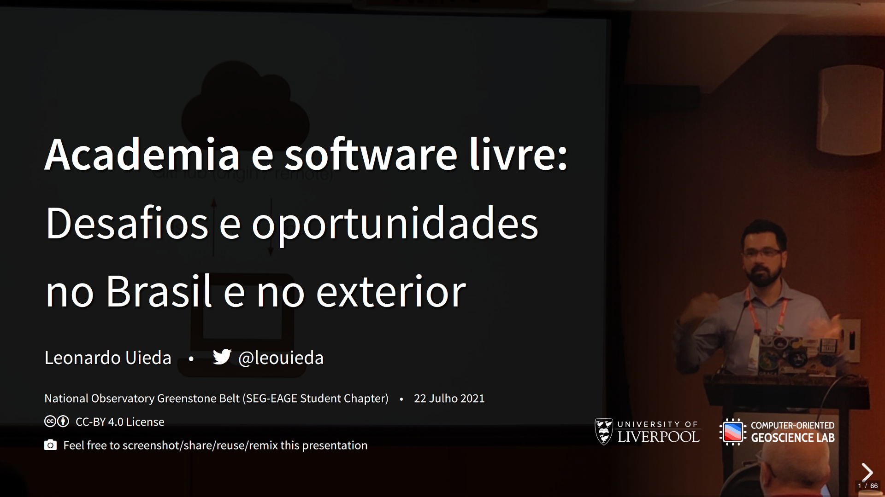

# Academia e software livre: Desafios e oportunidades no Brasil e no exterior

Palestra e bate papo com o National Observatory Greenstone Belt
(SEG-EAGE Student Chapter do [Observatório Nacional](https://on.br))
sobre minha carreira e dicas para os alunos que quiserem trilhar um caminho
parecido.

| | Info |
|--:|:------|
| Quando | 22 Julho 2021 20:00 UTC |
| Slides | https://www.leouieda.com/2021-02-22-on |
| Gravação | https://www.youtube.com/watch?v=r2x-DN6laj8 |



## Serving the slides

## Locally

Install [livereload](https://github.com/lepture/python-livereload):

```
pip install livereload
```

or

```
conda install livereload -c conda-forge
```

Use `make serve` to start a server at http://localhost:8008. The page will
automatically reload the page when you update any of the files in the
repository.

## License

The template (`slides.md`, `index.html`, and `css/style.less`) is licensed under a
<a href="https://creativecommons.org/licenses/by/4.0/">Creative Commons
Attribution 4.0 International License</a>.
