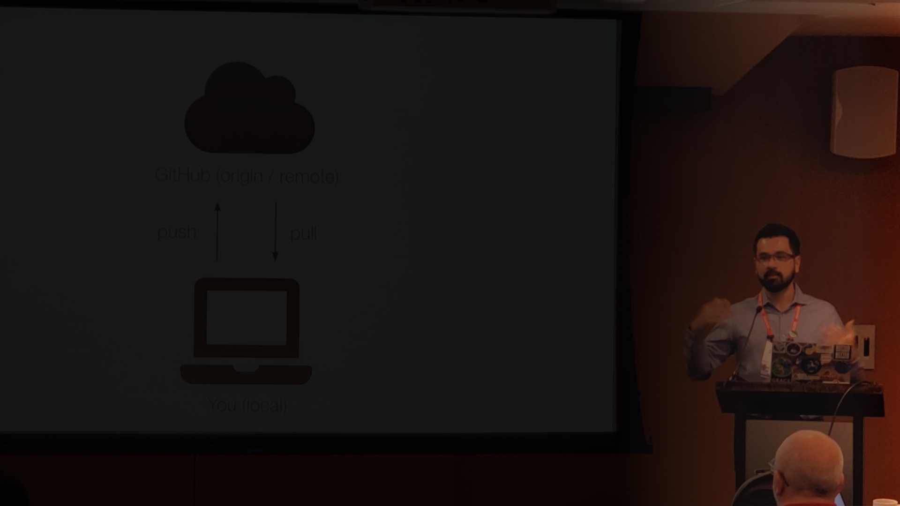

<!--
This file defines the contents of each slide.
The reveal.js configuration can be found in index.html
-->

<!-- .slide: class="slide-title" data-background-image="assets/title-slide.svg" data-background-color="#000000" data-background-repeat="no-repeat" data-background-position="center" -->

<!-- Place the content at the bottom of the slide -->

<!-- Main title page -->

<h1 id="talk-title">
<strong>Academia e software livre:</strong>
 
Desafios e oportunidades
 
no Brasil e no exterior
</h1>

    Leonardo Uieda
    •
    <i class="fab fa-twitter fa-fw"></i>
    <a href="https://twitter.com/leouieda">@leouieda</a>

<!-- Place location and date side-by-side with affiliation logos -->

National Observatory Greenstone Belt (SEG-EAGE Student Chapter)
•
22 Julho 2021

<!-- Permission to reuse and CC-BY license logo -->

<a href="https://creativecommons.org/licenses/by/4.0/">
<i class="fab fa-creative-commons"></i><i class="fab fa-creative-commons-by" style="margin: 0 10px 0 2px"></i>
CC-BY 4.0 License
</a>

<i class="fa fa-camera" style="margin: 0 10px 0 0"></i>
Feel free to screenshot/share/reuse/remix this presentation

<!-- Add logos here. Need these wrappers to align them to the bottom right -->

    
    

---

<!-- .slide: class="slide-transition" data-background-color="#0044aa" -->

1. Quem eu sou
1. O que eu faço
1. Como eu cheguei até aqui

---

<!-- .slide: data-background-video="assets/brasil-sao-paulo-rio.mp4" data-background-size="contain" data-background-color="#000000" -->

Sou do interior de São Paulo, região com o melhor sotaque do Brasil

---

<!-- .slide: data-background-image="assets/sao-paulo.svg" data-background-size="contain" data-background-repeat="no-repeat" data-background-color="#000000" -->

Trivia: [Botucatu](https://pt.wikipedia.org/wiki/Botucatu) é a sede da
Associação Nacional de Criadores de Saci

---

Graduado em Geofísica pela USP

Mesma turma que o Vanderlei.

Descobri a programação e continuei indo atrás (matérias, IC, hobby).

---

Intercâmbio na York University, Canada.

Amigos até hoje, culturas diferentes, geodésia (ainda tenho contato com meu
professor).

---

Mestrado e Doutorado pelo ON com a Valéria.

Valéria me deixou livre pra programar.

Interesse em ciência aberta, reprodutibilidade e divulgação

Comecei a investir nas ferramentas open-source.

---

Professor na UERJ.

Experiência excelente de dar aula e interagir com os outros professores.

Aprendi muito: pedagogia, assunto (sísmica e geologia), relações humanas

Hora para pensar a longo prazo e colocar minhas ideias em contexto

---

Pesquisador visitante na UH (posdoc)

Abriu meus olhos para como a ciência funciona no resto do mundo.

Ressaltou as vantagens do Brasil.

Acesso à rede de pesquisadores renomados (Paul é muito popular).

Pensar sobre financiamento, impacto da pesquisa na sociedade, aplicações,
colaborações, etc.

---

Saí da UERJ e Professor (lecturer) em Liverpool.

---

<!-- .slide: class="slide-transition" data-background-color="#0044aa" -->

# O que eu faço

---

Modelagem direta com tesseroides. Primeira coisa que eu trabalhei.

---

Inversão de métodos potenciais (grav + mag)

Escala local a global

Filme da sementinha.

---

Software

Fatiando, tesseroides, GMT

Pesquisa e ensino

---

Ensino

Várias matérias: programação, grav, sensoriamento remoto, campo, etc.

Usa programação em tudo.

---

<!-- .slide: class="slide-transition" data-background-color="#0044aa" -->

# Como eu cheguei até aqui

---

# Privilégio

Pais acadêmicos

Classe média

Interior de São Paulo

Suporte familiar

Escola privada

Inglês

Homem

Branco + asiático

Brasil tem bolsas e ensino público gratuito

---

# Sorte

Prestei geofísica

Entrar na USP em 2004 foi crucial. Turma foda. Professores foda.

Período de crescimento econômico do país

Valéria me aceitou mesmo com más recomendações

Mentores excepcionais: Manoel, Naomi, Carla, Valéria, Paul

Vaga na UERJ na hora certa

Vaga do GMT na hora certa

Vaga em Liverpool na hora certa

Gostei de programação na hora certa

---

# Oportunidades

Privilégio e sorte foram fatores importantes para essas oportunidades serem
acessíveis.

Sempre busquei, pesquisei, perguntei, apliquei

USP e ON forneceram muitas (financiamento e incentivo)

Fui em todos os congressos que consegui

Estabeleci contatos

Aproveitei e me expus: não neguei apresentações, divulgo meu trabalho, converso
com picudos.

---

# Rede de apoio

Turma do IAG

Turma do ON

---

# Disclaimer

Essa é a minha experiência.

Minha experiência não é aplicável a todos

Não são prerequisitos

Outros caminhos são possíveis

---

<!-- .slide: class="slide-transition" data-background-color="#0044aa" -->

# Academia + software

---

# Software na ciência

Por que é importante, etc.

---

# Software livre

Interesse por software livre na faculdade (PCs era linux)

Reprodutibilidade, "stand on the shoulders of giants"

---

# Oportunidades

O que se tem a ganhar investindo em software

Reputação, publicações, agilidade na pesquisa, ensino de qualidade, currículo
competitivo fora da academia, rede de contatos.

---

# Desafios

Cuidados para se tomar.

Carreira acadêmica ainda precisa de papers + projetos. Pelo menos o mínimo para
ser competitivo. Financiamento de software. Burnout. Trabalho voluntário
depende de privilégio.

---

<!-- .slide: class="slide-transition" data-background-color="#0044aa" -->

# Dicas

---

# Geral

Reconheça seus privilégios.

Busque oportunidades e tome proveito.

Pense e se comporte como um profissional, não como aluno.

Ser independente, ativo, entusiasmado, não ser passivo, mostrar interesse, tome
as rédias, a vida é sua.

Vocês não são mais estudantes. São profissionais. Sua carreira depende de vocês
também, não só fatores externos.

---

# Programação

Aprendizagem contínua (mesmo depois de 17 anos)

Estude tudo que tem no Software Carpentry

Progresso iterativo

Leia o código dos outros

Simples é melhor que rápido

Se envolva em projetos

Entre no Software Underground

---

# Exterior (EUA e Europa)

Tudo custa dinheiro.

Alunos independentes são valorizados

Visto, mudança, etc são caros e difícil de financiar

Tem que passar um tempo fora para conseguir um emprego

Rede é tudo (recomendações e nomeações)

Projetos > papers (dinheiro é muito importante)

Bolsas nos EUA são mais fáceis pois podem ser pagas por projeto de professor.

Precisa de certificado de inglês (TOEFL e IELTS)

Ir com dinheiro próprio (do Brasil) é muito mais fácil mas tem restrições

The Professor Is In é obrigatório

---

<!-- .slide: data-background-image="assets/title-slide.svg" data-background-size="contain" data-background-opacity="0.5" data-background-repeat="no-repeat" data-background-color="#ffffff" -->

Big quote message with a faded background image.
Bla bla bla bla bla bla bla bla bla bla bla bla bla bla bla.

---

# Two column layout

## Subtitle

This is how you make a FontAwesome list:

<ul class="fa-ul">

<li>
 <i class="fa fa-lightbulb fa-fw"></i> 
Make a list with
</li>

<li>
 <i class="fa fa-file-alt fa-fw"></i> 
some awesome icons
</li>

<li>
 <i class="fa fa-users fa-fw"></i> 
instead of bullet points
</li>

</ul>

Some text explaining the figure.
Maybe even a bit of maths like $\gamma$

Good place for a citation

---

# This one has columns of different size

This way the image is larger on the screen. Use it for maps or main figures.

Explain what is shown on the image.

Maybe include some maths:

$ D\dfrac{\partial^4 w}{\partial x^4} = q - g (\rho_m - \rho_w) w $

Good place for a citation

---

# A boring normal slide

This is a boring list:

* Some bullet points
* Some [even have links](https://www.compgeolab.org)

---

<!-- .slide: class="slide-contact" data-background-image="assets/contact-slide.svg" data-background-position="top" data-background-color="#000000" -->

# Contato

<ul class="fa-ul" style="">
<li><i class="fa-li fa fa-envelope"></i>

[Leonardo.Uieda@liverpool.ac.uk](mailto:Leonardo.Uieda@liverpool.ac.uk)

</li>
<li><i class="fa-li fab fa-twitter"></i>

[@leouieda](https://twitter.com/leouieda)

</li>
<li><i class="fa-li fa fa-desktop"></i>

[www.leouieda.com](https://www.leouieda.com)

</li>
<li><i class="fa-li fa fa-flask"></i>

[www.compgeolab.org](https://www.compgeolab.org)

</li>
</ul>

---

<!-- .slide: class="slide-license" -->

<i class="fab fa-creative-commons"></i><i class="fab fa-creative-commons-by"></i>

Unless otherwise noted,
the contents of this presentation are
licensed under the
 
[Creative Commons Attribution 4.0 International License](https://creativecommons.org/licenses/by/4.0/).

