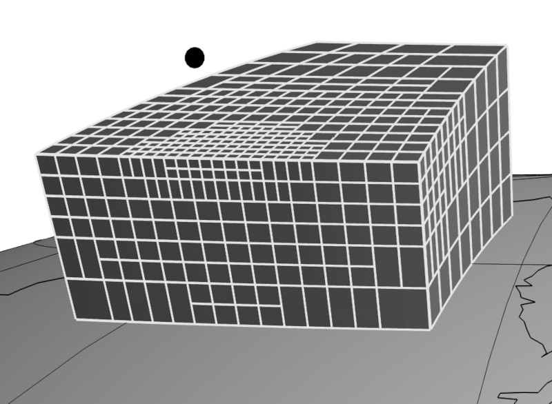
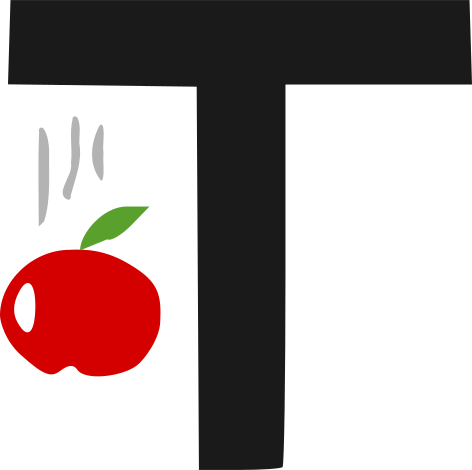
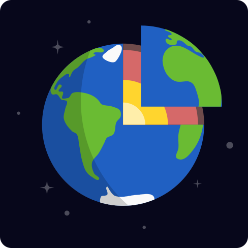
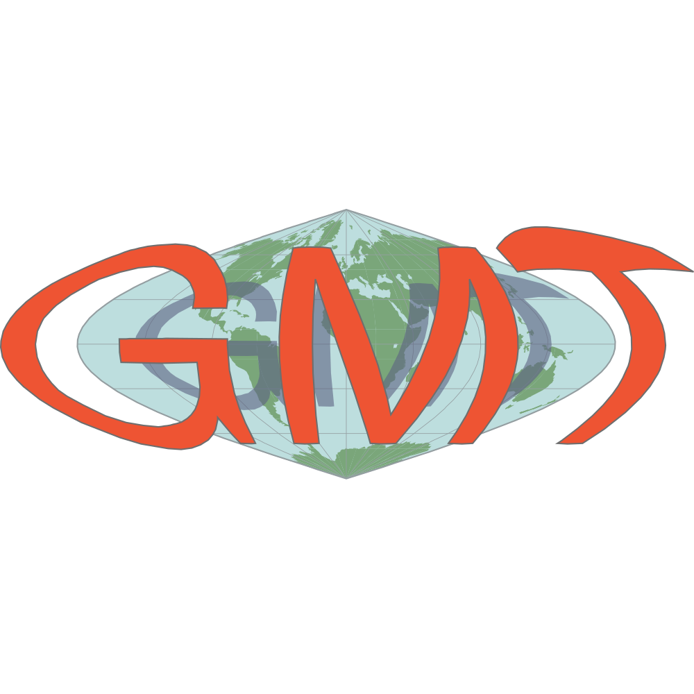

<!--
This file defines the contents of each slide.
The reveal.js configuration can be found in index.html
-->

<!-- .slide: class="slide-title" data-background-image="assets/title-slide.svg" data-background-color="#000000" data-background-size="contain" -->

<!-- Place the content at the bottom of the slide -->

<!-- Main title page -->

<h1 id="talk-title">
<strong>Academia e software livre:</strong>
 
Desafios e oportunidades
 
no Brasil e no exterior
</h1>

    Leonardo Uieda
    •
    <i class="fab fa-twitter fa-fw"></i>
    <a href="https://twitter.com/leouieda">@leouieda</a>

<!-- Place location and date side-by-side with affiliation logos -->

National Observatory Greenstone Belt (SEG-EAGE Student Chapter)
•
22 Julho 2021

<!-- Permission to reuse and CC-BY license logo -->

<a href="https://creativecommons.org/licenses/by/4.0/">
<i class="fab fa-creative-commons"></i><i class="fab fa-creative-commons-by" style="margin: 0 10px 0 2px"></i>
CC-BY 4.0 License
</a>

<i class="fa fa-camera" style="margin: 0 10px 0 0"></i>
Feel free to screenshot/share/reuse/remix this presentation

<!-- Add logos here. Need these wrappers to align them to the bottom right -->

    
    

---

<!-- .slide: class="slide-transition" data-background-color="#0044aa" -->

1. Quem eu sou
1. O que eu faço
1. Software livre na ciência
1. Como eu cheguei até aqui
1. Dicas

---

<!-- .slide: data-background-video="assets/brasil-sao-paulo-rio.mp4" data-background-size="contain" data-background-color="#000000" -->

Interior de São Paulo: região com o melhor sotaque do Brasil

---

<!-- .slide: data-background-image="assets/sao-paulo.svg" data-background-size="contain" data-background-repeat="no-repeat" data-background-color="#000000" -->

Trivia: [Botucatu](https://pt.wikipedia.org/wiki/Botucatu) é a sede da
Associação Nacional de Criadores de Saci

---

<!-- .slide: data-background-image="assets/iag.svg" data-background-size="contain" data-background-repeat="no-repeat" data-background-color="#000000" -->

Mesma turma que o Vanderlei.

---

<!-- .slide: data-background-image="assets/first-contact-with-c.jpg" data-background-size="contain" data-background-repeat="no-repeat" data-background-color="#000000" -->

Esse código compilou e rodou na primeira tentativa!

---

<!-- .slide: data-background-image="assets/york.svg" data-background-size="contain" data-background-repeat="no-repeat" data-background-color="#000000" -->

---

<!-- .slide: data-background-image="assets/on.svg" data-background-size="contain" data-background-repeat="no-repeat" data-background-color="#000000" -->

Orientado pela Valéria Barbosa.
 
Interesse em ciência aberta, reprodutibilidade, software livre

---

<!-- .slide: data-background-image="assets/meetings.svg" data-background-size="contain" data-background-repeat="no-repeat" data-background-color="#000000" -->

Aproveitei meu tempo no ON para ir em todos os congressos possíveis

---

<!-- .slide: data-background-image="assets/on-bigode.jpg" data-background-size="contain" data-background-repeat="no-repeat" data-background-color="#000000" -->

Turma da pós-graduação numa "Terça do Bigode".

---

<!-- .slide: data-background-image="assets/uerj.svg" data-background-size="contain" data-background-repeat="no-repeat" data-background-color="#000000" -->

Aprendi muito: pedagogia, geologia, relações humanas
 
Hora para pensar na carreira a longo prazo
 
(fonte: [Renato Mariz](https://commons.wikimedia.org/wiki/File:UERJ_2.jpg) | CC-BY-SA)

---

<!-- .slide: data-background-image="assets/uh-manoa.svg" data-background-size="contain" data-background-repeat="no-repeat" data-background-color="#000000" -->

Vista da minha janela: campus e Manoa Valley com um arco-íris
 
Abriu meus olhos para como a ciência funciona no exterior

---

<!-- .slide: data-background-image="assets/liverpool.svg" data-background-size="contain" data-background-repeat="no-repeat" data-background-color="#000000" -->

---

<!-- .slide: data-background-image="assets/baking-evolution.svg" data-background-size="contain" data-background-repeat="no-repeat" data-background-color="#000000" -->

Minhas habilidades de padeiro evoluíram mais que qualquer outra coisa

---

<!-- .slide: class="slide-transition" data-background-color="#0044aa" -->

# O que eu faço

---

# Modelagem direta

Campos gravitacionais

Elementos esféricos (tesseroides)

Integração numérica

Lançamento do satélite GOCE em 2009

Graduação até o Doutorado

Tesseroide após discretização adaptativa
([Uieda et al., 2016](https://doi.org/10.1190/geo2015-0204.1))

---

<video style="width: 100%" muted data-autoplay loop>
<source data-src="assets/planting-inversion.mp4" type="video/mp4"/>
</video>

Algoritmo de plantação para inversão de dados gravimétricos
 
([Uieda & Barbosa, 2012](https://doi.org/10.1190/geo2011-0388.1))

# Inversão 3D

Desenvolvimento de métodos

Métodos potenciais (grav + mag)

Escala local a global

Intrusões, recursos minerais, Moho

---

# Software livre

## Tesseroids

(2008)

## Fatiando a Terra

(2010)

## GMT

(2017)

---

<video style="width: 100%" muted data-autoplay loop>
<source data-src="assets/seismic-waves-demo.mp4" type="video/mp4"/>
</video>

Exemplo de um notebook da minha matéria de sísmica na UERJ

# Ensino

Programação onipresente

Simulação e dados reais

Empodera os alunos

Gravimetria, geodinâmica, sensoriamento remoto, programação, campo

---

<!-- .slide: class="slide-transition" data-background-color="#0044aa" -->

# Software livre na ciência

---

ciência contemporânea
 
depende de software

---

"Research software infrastructure is critical for **accelerating science**,
and yet, these digital public goods are often **unsustainably funded**."

[Knowles et al., (2021)](https://doi.org/10.1038/s43588-021-00048-5)

---

trabalho voluntário exclui os desprivilegiados

---

avanço na acadêmica = papers + projetos

pelo menos o mínimo para ser competitivo

---

**vantagens:**
reputação, publicações,
 
agilidade na pesquisa, qualidade de ensino,
 
currículo competitivo fora da academia

---

mais informações:
 
https://www.software.ac.uk/resources/get-speed

---

<!-- .slide: class="slide-transition" data-background-color="#0044aa" -->

# Como eu cheguei até aqui

---

# 1. Privilégio

---

homem / branco + asiático / classe média

---

interior de São Paulo / escola privada

---

pais acadêmicos / aprendi inglês nos EUA

---

bolsas e ensino superior público gratuito

---

# 2. Sorte

---

geofísica ao invés de física
/
entrei na USP em 2004

---

período de crescimento econômico do país

---

interesse pela programação e bons professores

---

vagas na hora certa (UERJ, GMT, Liverpool)

---

Mentores **excepcionais**:

Manoel D'Agrella,
Naomi Ussami,
Carla Braitenberg,
Valéria Barbosa,
Paul Wessel

---

# 3. Oportunidades

---

privilégio <i class="fa fa-arrow-right"></i> oportunidades acessíveis

---

pesquisei, perguntei, **apliquei**

---

estabelecer contatos é crucial

---

# 4. Esforço

---

estudei e trabalhei além do mínimo

---

participei: apresentações, congressos, internet

---

cultivei meus contatos

---

me expus: código, slides, material didático

---

essa foi a minha experiência

não é necessariamente transferível

**nem é o único caminho possível**

---

<!-- .slide: class="slide-transition" data-background-color="#0044aa" -->

# Dicas

---

# Exterior

EUA / Europa / Reino Unido

---

# <i class="fa fa-pound-sign"></i>

visto e viagem muitas vezes é você quem paga

bolsa/salário pode demorar 1-2 meses para cair

o custo de tudo é mais evidente

bolsas nos EUA são pagas por projeto do orientador

---

certificado de inglês (TOEFL ou IELTS)

PhD/posdoc fora primeiro é quase um requisito

recomendações são muito importantes

demonstrar capacidade de conseguir financiamento

---

Leitura obrigatória:
[The Professor Is In](https://theprofessorisin.com/)
(blog e livro)

---

Listas de oportunidades:

https://www.leouieda.com/blog/job-sites.html

---

# Programação

---

estude **tudo** do [Software Carpentry](https://software-carpentry.org/)

---

aprenda com o código dos outros

---

aprendizagem contínua

---

se envolva em projetos open-source

[fatiando.org/#contribute](https://www.fatiando.org/#contribute)
 😉

---

# Geral

---

seja independente, ativo, entusiasmado

tome as rédias da sua carreira e educação

---

rede de contatos é essencial

demora anos para estabelecer

**participe** de congressos, não só esteja presente

---

participe, pergunte, ensine, aprenda

[Software Underground](https://softwareunderground.org/)

[Geolatinas](https://geolatinas.weebly.com/)

[Earth Science Women's Network](https://eswnonline.org/)

[Black in Geoscience](https://blackingeoscience.org/)

---

🚨 **MAIS IMPORTANTE** 🚨

se comporte como profissional, não como aluno

---

<!-- .slide: class="slide-contact" data-background-image="assets/contact-slide.svg" data-background-position="top" data-background-color="#000000" -->

# Contato

<ul class="fa-ul" style="">
<li><i class="fa-li fa fa-envelope"></i>

**email:** [Leonardo.Uieda@liverpool.ac.uk](mailto:Leonardo.Uieda@liverpool.ac.uk)

</li>
<li><i class="fa-li fa fa-home"></i>

**website:** [leouieda.com](https://www.leouieda.com)

</li>
<li><i class="fa-li fa fa-flask"></i>

**grupo:** [compgeolab.org](https://www.compgeolab.org)

</li>
<li><i class="fa-li fa fa-desktop"></i>

**slides:** [leouieda.com/2021-07-22-on](https://www.leouieda.com/2021-07-22-on)

</li>
</ul>

---

<!-- .slide: class="slide-license" -->

<i class="fab fa-github"></i>

Source code:
[github.com/leouieda/2021-07-22-on](https://github.com/leouieda/2021-07-22-on)

<i class="fab fa-creative-commons"></i><i class="fab fa-creative-commons-by"></i>

Unless otherwise noted,
the contents of this presentation are
licensed under the
 
[Creative Commons Attribution 4.0 International License](https://creativecommons.org/licenses/by/4.0/).

